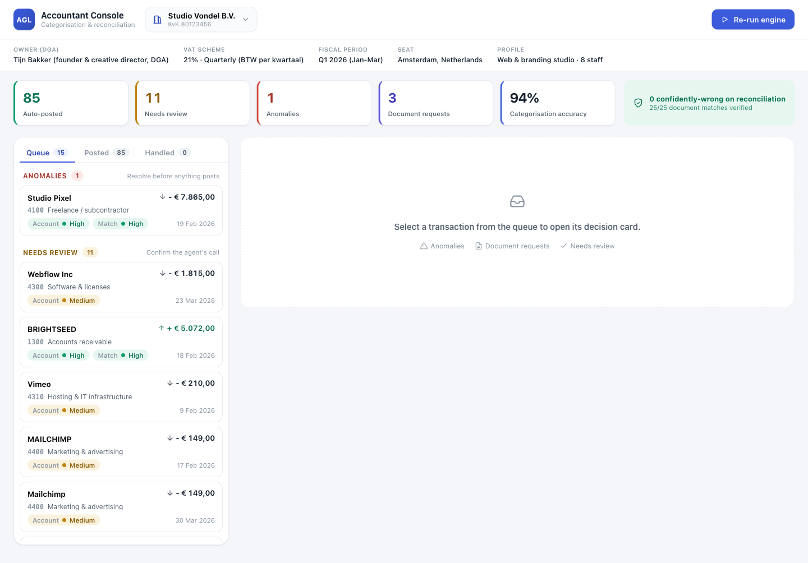
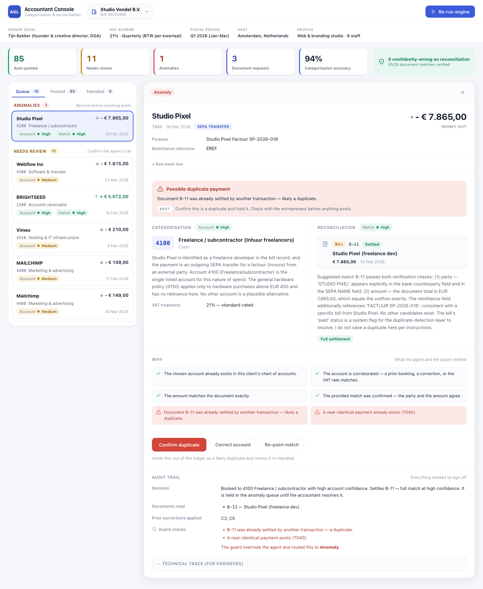
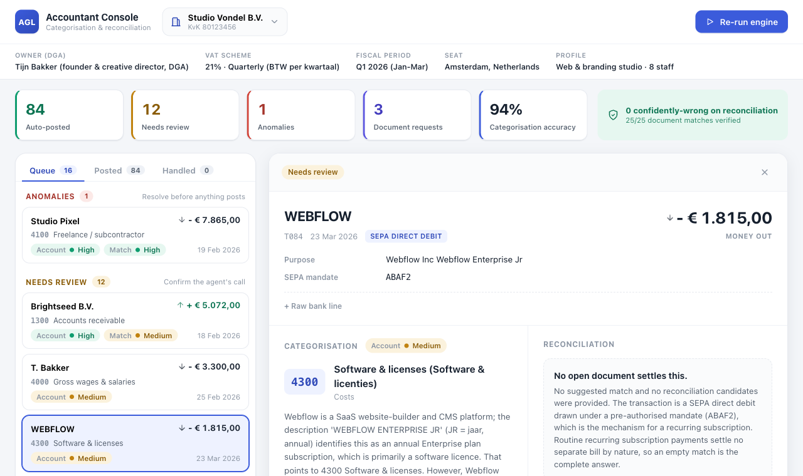
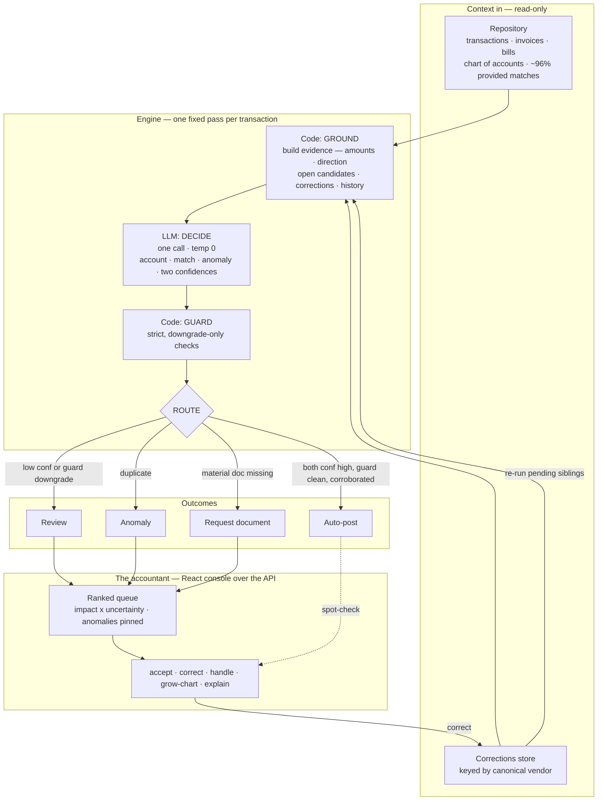
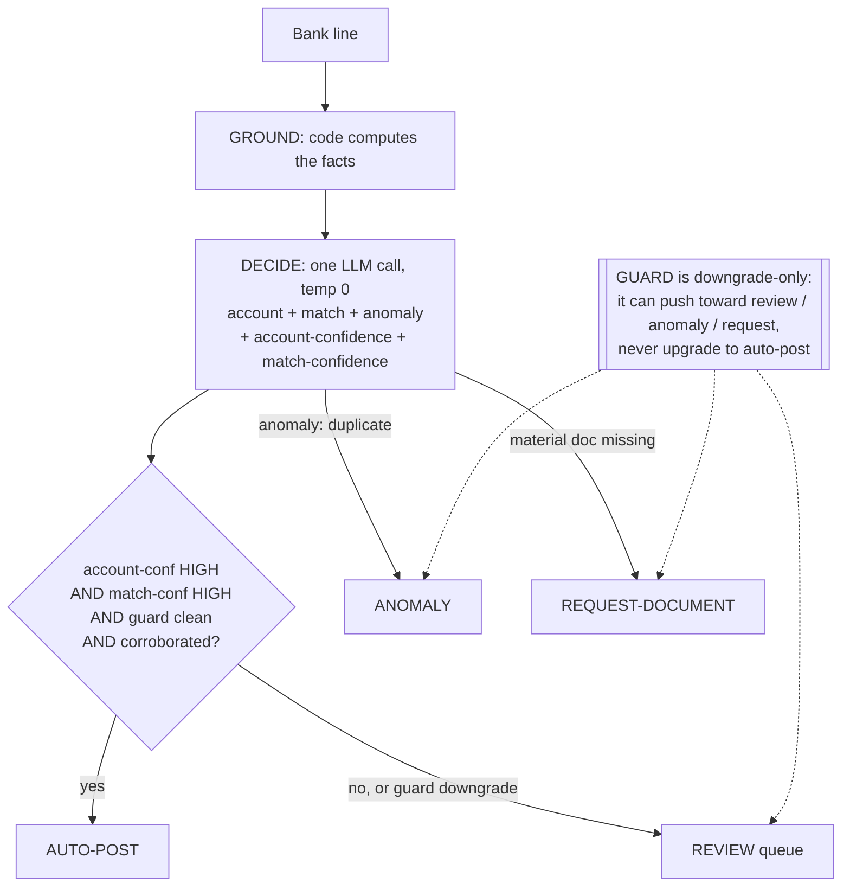
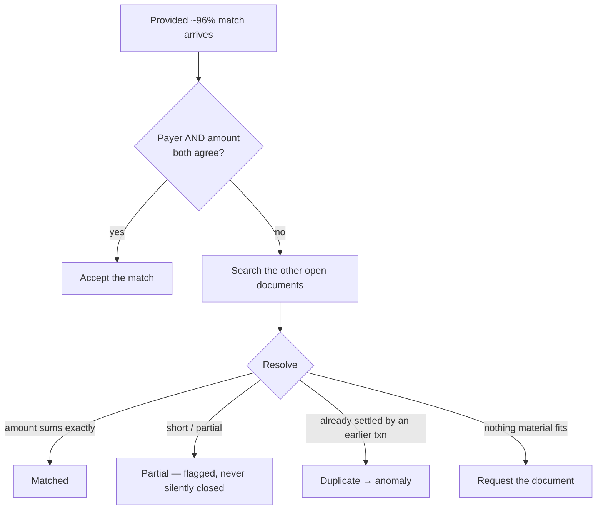
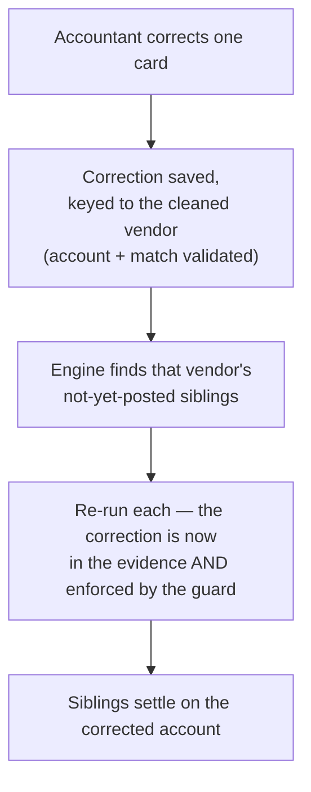

# Project AGL — Agentic General Ledger (Neno Challenge 2)

An accountant-supervised LLM agent that **categorises and reconciles** a Dutch small-business's
bank feed, **auto-posts what it is sure of**, and **defers the rest to a ranked human queue**. On the
seeded 100-transaction dataset it auto-posts **85 of 100** entries at **0.95 categorisation accuracy**
and **25/25 reconciliation accuracy**, with a measured **false-confidence of 1** — a single immaterial
categorisation, and **zero on reconciliation and on every material entry**. False-confidence ("the agent
was sure and wrong") is the number that kills trust, so the whole design serves one goal: **never be
confidently wrong.**

> One principle runs through everything: **the agent (the LLM) decides; code only grounds the facts
> and guards the post.** The LLM picks the account, decides which invoice or bill a payment settles,
> flags anomalies, and rates its own confidence. Code computes the verifiable facts the LLM is given
> (amounts, payment direction, which documents are still open) and runs a strict, *downgrade-only*
> guard before anything auto-posts. The LLM is never trusted with arithmetic, and its confidence can
> never push a fact-contradicting entry onto the books.

---

## 1. What this is

Neno is a fintech building tooling for accountants who serve many small businesses. Challenge 2 is the
surface "where every decision matters": take a customer's bank transactions, categorise each to the
**chart of accounts** (the numbered ledger every entry is booked to), reconcile it against the
customer's invoices and bills, and decide — *per entry* — whether the agent is sure enough to post it
or whether a human should look first. This repository is a live, end-to-end prototype of that agent,
wired to a real LLM (Claude Sonnet 4.6, with a Gemini 2.5 Pro fallback), with an accountant console and
a reproducible evaluation.

The modelled customer is **Studio Vondel B.V.**, an 8-person web & branding studio in Amsterdam, over
**Q1 2026**. (Glossary of the Dutch accounting terms and the account-code classes is in
[§7 The data](#7-the-data).)

### Why Challenge 2

Neno's case had two challenges, two front doors onto **one product**: the accountant-supervised ledger
(Challenge 2) and the entrepreneur conversation (Challenge 1, the small-business owner asking "what's my
VAT this quarter?"). **This submission builds Challenge 2** — it is the surface where *every decision
matters* (a wrong post flows into the VAT return and the audit), so it is where the brief's hard
questions live: act-vs-defer, the precision bar, false-confidence, and learning from corrections.

The contrast with Challenge 1 is deliberate and is itself a design point: the entrepreneur side is an
*open-ended, interactive* conversation, so it genuinely wants a **tool-calling** agent (latency-bound —
"an answer before the coffee cools"). The accountant side is a *fixed, batch* decision per transaction,
so it wants a **single-pass** agent (correctness-bound). Same grounded engine, the right interaction
pattern per job. Challenge 1 is on the roadmap (§11), running tool-calling over this same engine.

## 2. What it does — the capabilities

For each bank transaction the system:

1. **Categorises** it to one chart-of-accounts account (e.g. office rent, freelance cost, owner's
   draw, a cleared receivable).
2. **Reconciles** it against the open invoices and bills — *verifying*, not trusting, the
   transaction↔document match that Neno's infrastructure provides (those are only ~96% right).
3. **Flags anomalies** (a duplicate payment, a missing counterpart document, a suspicious line) on a
   concrete, grounded signal — never on a hunch.
4. **Gates posting on confidence**: it rates two *independent* confidences (one for the account, one for
   the match) and auto-posts only when both are high and a strict guard passes; everything else defers.
5. **Requests a missing document** from the entrepreneur when a *material* expense has no bill on file
   (distinct from a low-stakes missing counterpart that merely goes to review).
6. **Presents a ranked accountant queue** ordered by where the human's attention is worth most —
   *impact × uncertainty* — with anomalies pinned to the top.
7. **Learns from corrections**: when the accountant corrects one card, the fix is keyed to the cleaned
   vendor name and immediately re-runs that vendor's other not-yet-posted transactions — one edit moves
   the siblings, not just the one.

### The accountant console

The console is a decoupled React client of the engine's JSON API. The accountant runs the engine, then
works the queue: read a card, accept it, correct it (a dropdown, not code), or ask the agent to explain.


*The queue is ranked by impact × uncertainty (euro value × VAT-sensitivity × probability of being
wrong), with anomalies pinned on top — so scarce attention lands where a mistake is both likely and
costly. The confident bulk is not here; it sits in the auto-posted set, spot-checkable.*


*Every card shows the agent's choice, its one-sentence reasoning, the verified facts as sources, and
the two confidences. An anomaly card (here, a duplicate payment) also shows the next action the
accountant clicks — request the document, flag, or dismiss.*


*An uncertain entry surfaced for review, with the context the accountant needs to decide: the candidate
documents, the amount/party check, and why the agent declined to post it on its own.*

The console gives the accountant exactly the levers the brief asks for, plus the two that close the
learning loop. The agent's reasoning is shown on **every card, always** — so explanation is always-on, not a click — and none of these levers is a second LLM call:

| Lever | Endpoint | What it does |
|-------|----------|--------------|
| **Accept** | `POST /transaction/{id}/accept` | Post the agent's decision as-is (moves it into the posted ledger). |
| **Correct** | `POST /transaction/{id}/correct` | Re-point the account and/or the match (a dropdown). Saves the correction and immediately re-runs the vendor's pending siblings. |
| **Handle** | `POST /transaction/{id}/handle` | The next action on a flagged card — `flag_duplicate` for an anomaly, `request_document` for a missing material bill — logged out of the active queue. |
| **Grow the chart** | `POST /account`, `POST /transaction/{id}/assign-account` | When *no listed account fits*, create the new chart entry and assign it (the chart grows at runtime; the cohort learns it). |

The queue itself (`GET /queue`) is ranked by **impact × uncertainty** with anomalies pinned; the
confident bulk lives in the auto-posted ledger (`GET /posted`), reasoning visible, spot-checkable in bulk
rather than touched one by one. That untouched bulk is the capacity gain.

## 3. Quick start

**Prerequisites:** Python 3.12+, [uv](https://docs.astral.sh/uv/), Node 18+ with npm, and a way to
reach the LLM:

- **Default (no API key):** the `claude` CLI signed in. The agent then runs headless via `claude -p` on
  the Claude subscription. This is the path that produced the committed eval numbers.
- **Hosted API:** set `ANTHROPIC_API_KEY` to drive **Claude Sonnet 4.6** directly (the model the eval
  used), or `GEMINI_API_KEY` / `GOOGLE_API_KEY` to fall back to **Gemini 2.5 Pro**. Either key (or
  `AGL_AGENT=llm`) switches the engine to the hosted `pydantic-ai` path; override the model with
  `AGL_MODEL`.

```bash
# 1. Build the React console. Output lands in frontend/dist/, which the backend serves.
cd frontend
npm install
npm run build          # tsc && vite build  (per frontend/package.json)
cd ..

# 2. Start the backend API (it serves the built console from frontend/dist/, so build it first).
cd backend
uv sync                # creates .venv and installs deps from pyproject.toml
uv run uvicorn agl.api:app --port 8137
# open http://127.0.0.1:8137/ and click "Run engine"
# (it confirms first — a full run is ~100 LLM calls, one per transaction)

# 3. Run the evaluation (cold-vs-warm over all 100; rewrites backend/eval_artifact.json).
uv run python scripts/run_eval.py --agent claude --subset all
```

The eval defaults to a 37-transaction `representative` subset; `--subset all` reproduces the committed
100-transaction artifact. Use `--agent llm` to score the hosted-API path instead of `claude -p`.

**Frontend development with hot reload** — run the API and the Vite dev server together; the dev server
(port 5174) proxies `/api` to the backend on 8137 (see `frontend/vite.config.ts`):

```bash
cd backend  && uv run uvicorn agl.api:app --port 8137   # terminal 1
cd frontend && npm run dev                               # terminal 2 → http://127.0.0.1:5174
```

## 4. Architecture

The agent's topology is deliberately the *simplest thing that meets the precision bar*: one fixed pass
per transaction — **ground → decide → guard → route** — with no agentic tool-calling loop. The
boundary that matters is **LLM decides | code grounds + guards**.


*The whole topology on one diagram: context flows in, code grounds the facts, the LLM makes one
decision, code guards it, the router sends it to an outcome, and the accountant works the ranked queue —
with the correction loop feeding learned conventions back into grounding. The guard and router can only
make an outcome safer, never auto-post something the agent wasn't confident and corroborated on.*

### The components

| Component | File | Role |
|-----------|------|------|
| **Repository** | `backend/agl/repository.py` | Loads the read-only seed fixtures; serves the runtime corrections + added-accounts store kept strictly separate from the seeds. |
| **Grounding** | `backend/agl/grounding.py` | `build_evidence` computes every verifiable fact; `render_prompt` turns it into the prompt text. |
| **Reconcile** | `backend/agl/reconcile.py` | Finds candidate documents by amount/combination and validates a proposed match (sums exactly, direction OK). Pure arithmetic — never the LLM's job. |
| **Agent** | `backend/agl/agent.py` | The LLM behind one `AgentProtocol.decide`. Two interchangeable backends: `LlmAgent` (pydantic-ai, Sonnet 4.6 / Gemini 2.5 Pro) and `ClaudeCliAgent` (`claude -p`). |
| **Guard** | `backend/agl/guard.py` | The strict, downgrade-only backstop: checks the proposal against hard facts before any auto-post. |
| **Engine** | `backend/agl/engine.py` | Orchestrates ground → decide → guard → route as a two-pass batch. |
| **Learning** | `backend/agl/learning.py` | Canonical-vendor key, correction persistence, and the same-vendor sibling re-run. |
| **Console / API** | `backend/agl/api.py` | FastAPI surface (`/run`, `/queue`, `/posted`, `/correct`, `/explain`, `/metrics`, `/trace/{id}`) plus the stateful `Console`. |
| **Eval** | `backend/agl/eval.py`, `backend/scripts/run_eval.py` | Scores decisions against held-out ground truth; the cold-vs-warm lift harness. |
| **Observability** | `backend/agl/observability.py` | Env-gated Logfire wiring (off by default). |
| **Frontend** | `frontend/` | React + Vite + TypeScript console; built to `frontend/dist/`, served by the same FastAPI app. |

### The two-pass batch, and why

A run is **two passes**, not one (`engine.run_batch`):

- **Pass 1** grounds and decides every transaction *independently and concurrently* (bounded by a
  semaphore, retried, **fail-closed**: a transaction the agent can't decide is routed to review, never
  dropped and never aborting the run). No transaction sees any other.
- **Pass 2** builds the settlement map (which document each transaction claims) over the *whole* set,
  then finalizes each decision against it.

The reason is specific: **a duplicate is a cross-transaction fact.** Whether a payment is a duplicate
depends on whether *another* transaction already settled the same document — which Pass 1 cannot know in
isolation. Resolving it in Pass 2, from the full set, makes the duplicate the *later* claimant of a
shared document **regardless of processing order**, so the result is deterministic and never depends on
which transaction happened to run first.

### The code / LLM / human boundary

- **Code grounds** — it computes the facts (amounts, direction, which documents are open as of the
  transaction's date, the relevant corrections, vendor history) so the agent decides on facts, not
  guesses. An LLM is never asked for a sum.
- **The LLM decides** — the account, the match, the anomaly, and its own two confidences.
- **Code guards + routes** — the strict guard may only *downgrade* an auto-post; the router posts only
  when the agent is confident, corroborated, and the guard is clean.
- **The human supervises** — the accountant works the ranked queue, accepts/corrects/explains, and
  teaches the system through corrections.

## 5. How it works

### The single structured LLM call

There is exactly **one** model call per transaction (`agent.decide`), at **temperature 0**, with **no
tools and no loop**. The agent reads the grounded evidence and returns one typed object, the
**`Proposal`** (`backend/agl/models.py`):

```
Proposal {
  vendor              # the clean merchant name read from the messy bank line
  account             # the chart-of-accounts number it belongs to
  account_reasoning   # one sentence: why this account
  account_confidence  # HIGH | MEDIUM | LOW  — for the account decision
  account_unlisted    # true only when no listed account fits the spend
  match[]             # the invoice/bill id(s) it settles — empty if none
  match_reasoning     # one sentence: why this document, or null
  match_confidence    # HIGH | MEDIUM | LOW  — for the match decision
  anomaly?            # set only on a concrete signal: duplicate / missing_counterpart / ...
}
```

Structured output is ~100% schema-reliable, so the pipeline stays deterministic and auditable end to
end. (For the `claude -p` backend, the same schema is requested as JSON and validated.)

### Two independent confidences, and the corroboration rule

A transaction is **two decisions with different ways to be wrong**, so the agent rates them separately.
"This is office rent" can be certain while "this clears invoice INV-2026-004" is not, and vice versa. A
single confidence number would be either unsafe or lossy.

**Auto-post requires both confidences HIGH *and* a clean guard *and* corroboration.** The agent's HIGH
is not taken on faith for entries that can hurt the books: a **material** (≥ EUR 1,000), VAT-sensitive
entry whose matched document's counterparty does **not** appear in the bank line (and is not named in
the remittance) is downgraded to review even at self-high confidence (`engine._material_uncorroborated`).
Newness alone is never a reason to defer — categorising a novel transaction is the agent's job — only
low confidence, a contradicting guard, or high stakes without corroboration is.


*The confidence gate. The guard never improves an outcome — it can only make it safer.*

### The guard's check battery (strict, downgrade-only)

Before anything auto-posts, `guard.run_guard` checks the proposal against hard facts. **Every check can
only downgrade** the outcome (auto → review / anomaly / request-document); it never rewrites the agent's
choice. The checks, in plain English:

| Check | What it catches |
|-------|-----------------|
| **account-not-in-chart** / **account-unlisted** | The proposed account isn't a real chart entry, or the agent itself signalled no listed account fits. |
| **correction-conflict** | The account contradicts the *most recent* accountant correction pinned to this vendor (a known fix being silently undone). |
| **amount-mismatch** / **direction-mismatch** | The matched documents don't sum to the payment, or the payment direction and document type disagree (a bill matched to an inflow). |
| **reference-mismatch** | The remittance names one of our document ids, but the match doesn't include it. |
| **same-amount collision** (`amount_ambiguous`) | The matched document has a same-amount sibling and the counterparty doesn't corroborate — exactly the kind of swap the provided matches get wrong. |
| **revenue-on-settled-invoice** | An incoming payment that settles an issued invoice is being booked to a revenue account — which would double-count revenue and output VAT (see the accrual trap in §7). |
| **account-contradicts-bill** | A settled bill is already booked to a different account than the one proposed. |
| **vat-inconsistent** | A settled document's realised VAT rate clearly contradicts the account's VAT treatment (fires only on a clear gap, never on a 0-vs-9% ambiguity). |
| **duplicate** | The document was already claimed by an *earlier* transaction → routed to anomaly. |
| **missing-document** | A material missing counterpart is unflagged → routed to request-document. |
| **possible-duplicate-payment** | An earlier transaction looks like the same payment (same amount + vendor within 14 days) with no shared document — the duplicate the id-collision map can't see. |

The guard's responsibility boundary is stated honestly: it enforces **fact contradictions** and the
**vendor → cost-account correction** class. Conventions that hinge on judgement (asset vs expense,
owner-draw vs cost) and match re-points are held by the confidence gate plus the eval, not the guard.

### Reconciliation: verify, don't trust

Neno's infrastructure supplies a transaction↔document match at ~96% accuracy across the feed — but only
~85% on the lines that actually *assert* a match (see §7). So the agent treats the provided match as a
**prior to verify**, not as truth, and records whether it confirmed or overrode it
(`provided_match_confirmed` / `provided_match_overridden`), so the ~4% the infra gets wrong surfaces
instead of auto-posting.


*Reconciliation as verification. Code computes the sums and direction; the agent decides which document
the counterparty and reference point to.*

### Context engineering — what code grounds in, and what it leaves out

The agent only decides well if it reads the right facts, so `grounding.build_evidence` assembles a tight,
per-transaction `Evidence` and `render_prompt` lays it out under labelled headings. **Grounded in:**

- **The transaction** — date, amount with an explicit *inflow/outflow* note, counterparty, description, type.
- **The chart of accounts** — every account's number, Dutch + English name, and rubriek (class).
- **Any document id named in the remittance** — our own invoice/bill ids written literally in the bank
  line (e.g. `INV-2026-004`), restricted to ids we actually hold; a hard reconciliation signal.
- **The suggested match (the ~96% prior)** with its *computed* facts — gap vs the document total, whether
  the direction fits, whether the document's party appears in the bank line, the realised VAT %, and the
  paid/unpaid status.
- **Reconciliation candidates** — the other open documents whose amount or party fits (including
  two-document combinations that sum to the payment), each with the same computed facts.
- **The relevant prior corrections** — vendor-specific conventions that match this line, plus general
  policies, labelled so the agent applies a policy only when its condition holds.
- **Vendor history** — how earlier transactions for this same vendor were booked.

**Deliberately left out:**

- **Arithmetic.** Code computes every sum, gap, and direction; the agent is never asked for a `Decimal`
  total — only *which* document the party and reference point to. An LLM is fluent, not arithmetic.
- **Any duplicate hint.** A duplicate is a cross-transaction fact, resolved in Pass 2 from the full
  settlement map — so the per-call evidence carries no shared state and assumes no processing order, and
  the agent is told never to raise a duplicate itself.
- **The ground-truth labels.** The account/match/outcome labels exist only for the eval; the agent never
  sees them.
- **Already-settled documents.** Candidates an earlier transaction credibly closed are removed from the
  pool (modelling "open as of the booked date"), except where a same-amount-sibling collision keeps a
  document reachable. Corrections are selected by vendor token-overlap, so unrelated vendors' conventions
  are left out — a cheap stand-in for the retrieval that production would use.

### Anomaly detection

The agent may set an `anomaly` of one of four types, and each is caught the right way:

- **Duplicate** (e.g. **T046**: Studio Pixel's EUR 7,865 bill B-11 paid a second time). The agent is told
  *never* to raise this itself — it can't see the other transactions. **Code** catches it in Pass 2: a
  document claimed by two transactions makes the *later* claimant the duplicate (`guard._claimed_earlier`
  → routed to **anomaly**), and a fingerprint check (`_fingerprint_duplicate`) also catches a same-amount,
  same-vendor payment within 14 days that shares no document.
- **Missing counterpart** — a material one-off payment whose bill is absent from the evidence; the agent
  raises it and the router sends it to **request-document** (below).
- **Miscategorised / suspicious_vendor / unusual_amount** — raised only on a concrete signal visible in
  the single transaction. Mere category uncertainty **lowers a confidence** (→ review) instead of
  fabricating an anomaly, so the anomaly channel stays trustworthy. (Committed eval: anomaly precision and
  recall both **1.0** — the one planted duplicate caught, zero false positives.)

### The request-document decision — when to ask the entrepreneur

A missing document is never silently dropped, but not every gap is worth interrupting the entrepreneur.
The distinction is **materiality**: a *material* expense with no bill on file (the agent flags
`missing_counterpart`) routes to **request-document** — a deliberate "ask the entrepreneur for this
bill" — whereas a low-stakes missing counterpart merely defers to review. The two material cases here are
**T049** (EUR 4,500 to a builder, no bill) and **T096** (cites "factuur 99213", no bill on file); both are
caught (recall **1.0**). One immaterial line over-defers (**T083**), so precision is 0.67 — left
intentionally, since a threshold tweak would only data-fit the seeds.

### Observability

Every decision has a deterministic **`GET /trace/{id}`** record — the grounded context, the exact prompt
the agent read, the raw `Proposal`, the guard verdict, the confidence signals, and the final `Decision` —
reconstructed on demand (so it never drifts) and rendered in the console's trace drawer. This is both the
audit surface a sign-off rests on and the bonus "clickable trace" the brief asks for. **Logfire** is also
wired (`observability.configure_logfire`), env-gated to this project's own `AGL_LOGFIRE_TOKEN` (any
ambient token is dropped, content is scrubbed, off by default): it auto-instruments the LLM call and spans
the pipeline (`run_batch` / `decide` / `finalize`, carrying outcome, guard verdict, and the two
confidences). Production adds dashboards and alerting on false-confidence regressions.

### The learning loop

A correction is **memory the agent decides with, plus a rule the guard enforces.** When the accountant
corrects a card, the fix is keyed to the **canonical vendor** the agent already identified (a clean
merchant name, never the raw IBAN), validated (the account must exist; every matched document must
resolve — else it fails closed), and written to the **runtime store** (the committed seeds are never
mutated). The engine then re-runs that vendor's **pending** (not-yet-posted) siblings, so the correction
both sits in their evidence *and* is backstopped by the guard.


*One edit moves the next ones. At demo scale the relevant corrections fit in the prompt; at production
scale they move to retrieval (see §11), while the guard still backstops the cost-account class.*

## 6. Design decisions, defended

Each decision records the choice, the why, and the **negative we accept** — the full log is in
[`DECISIONS.md`](DECISIONS.md).

**1. Single-pass, not an agentic tool-calling loop.** The per-transaction flow is *fixed* (one decide
step on pre-computed evidence), so a framework loop where the LLM chooses tools and re-engages with
results buys flexibility we don't use, at the cost of non-determinism, a tool-call error surface, and
100× the calls. Single-pass is deterministic, auditable, and cheapest (1 call/txn), and the agent's
judgement can never auto-post past the guard. *Negative accepted:* the agent decides in one shot, so its
evidence must be well-grounded up front — which the precision bar demands anyway. (Tool-calling is the
right pattern for the *entrepreneur* conversation, Challenge 1 — the right pattern per job.)

**2. Corrections injected into the agent's evidence, not embeddings RAG.** The brief says the *agent*
decides, so corrections must inform the agent's *decision* (they go into the prompt) — and a code-side
exact-rule guard enforces the cost-account class so a known fix always applies. At 5 corrections, all
relevant ones fit in the prompt; vector retrieval would be machinery for a problem that doesn't exist
yet. *Negative accepted:* this is a scale step — at hundreds of vendors per customer, correction
*selection* moves to retrieval (the store is already the index), and that is explained, not built for 5.

**3. Our own pipeline, not LangGraph / CrewAI.** The flow is fixed code, so an orchestration framework
adds a dependency and a layer of indirection without removing complexity. We keep the orchestration ours
and use `pydantic-ai` only as a *light wrapper around the one call* (typed output, retries, Logfire,
provider-swappability). *Negative accepted:* we write the batch/concurrency/retry code ourselves — but
it is small, obvious, and exactly what we need.

**4. The agent decides while code grounds and guards.** The brief is explicit that the account, the
match, the anomaly, and the confidence are *the agent's* decisions, and that code's role is grounding
and guardrails against hallucination. So code never decides: it computes facts and runs a strict
backstop that can only downgrade. *Negative accepted:* on messy real data the system defers more on day
one — which is the safe direction to be wrong in, and the auto-set grows as the system learns.

**5. Two confidences, not one.** The account and the match are different decisions with different
evidence and different failure modes, so a single number would be unsafe (hides a weak half) or lossy
(throws away which half is weak). *Negative accepted:* the agent must produce two calibrated ratings,
and the prompt has to teach the distinction — worth it for a money system.

**6. Queue ranked by impact × uncertainty.** "Where attention adds the most value" is read literally:
*probability of being wrong × cost of being wrong* (euro value × VAT-sensitivity), with anomalies
pinned. Not lowest-confidence-only (would surface trivial cents) and not euro-value-only (would surface
confident, safe big entries). *Negative accepted:* the weights (the VAT multiplier, the risk mapping)
are sensible defaults, not yet calibrated on real accountant behaviour — a Part C tuning step.

## 7. The data

The dataset models **Studio Vondel B.V.**, an **8-FTE Amsterdam web & branding studio**, over **Q1 2026
(Jan–Mar)**. It charges **21% BTW** (Dutch VAT) and files it quarterly. The human-readable docs are in
[`data/`](data/); the machine seeds the engine actually loads are in `backend/seeds/`.

| Artifact | Count | Notes |
|----------|-------|-------|
| Bank transactions | **100** | invoices paid in, expenses, payroll, taxes, ambiguous lines |
| Invoices issued | **10** | some paid, some still open (accounts receivable) |
| Bills received | **20** | 18 paid in Q1, 2 still open (accounts payable) |
| Chart of accounts | ~35 | a realistic Dutch SME chart |
| Provided matches | 26 positive | transaction↔document, **~96%** accurate (Neno infra) |
| Prior corrections | **5** | accountant conventions known from before Q1 |

### Reading the Dutch — a glossary

The bank feed is in Dutch, like the real thing. The terms a non-Dutch reader needs:

| Term | Meaning |
|------|---------|
| **BTW** | Dutch VAT (here 21% standard, 9% reduced e.g. transport, 0%/exempt e.g. insurance and exports) |
| **rubriek** | the *class* an account belongs to in the Dutch chart (the leading digit; see below) |
| **Omzet** | revenue / turnover |
| **Debiteuren** | accounts receivable (money clients owe) |
| **Crediteuren** | accounts payable (money owed to suppliers) |
| **inhuur (freelancers)** | hiring contractors / subcontractors — a *cost*, distinct from payroll |
| **brutoloon** | gross wages / salary (payroll) |
| **privé-opname** | the owner taking money out for personal use — **not** a business expense |
| **loonheffing** | payroll tax remitted to the tax office |
| **representatiekosten** | client entertainment / representation costs |
| SEPA Overboeking / Incasso · iDEAL · BEA Betaalpas | bank transfer / direct debit · Dutch online payment · debit-card point-of-sale |

### The account-code classes (rubrieken)

The leading digit of an account number tells you what *kind* of account it is:

- **0xxx — balance sheet / equity** (fixed assets & equity): e.g. `0150` hardware as a capitalised asset,
  `0600` privé-opnamen (owner's drawings).
- **1xxx — financial**: `1100` bank, `1300` Debiteuren (receivable), `1600` Crediteuren (payable),
  `1500`/`1510` reclaimable/payable VAT, `1700` payroll tax payable.
- **4xxx — costs** (where most categorisation happens): `4000` wages, `4100` freelance, `4200` rent,
  `4300` software, `4400` marketing, `4500` office supplies, `4900` the catch-all to *resist* overusing.
- **8xxx — revenue**: `8000` design & dev revenue.
- **9xxx — financial result**: interest, FX differences.

### The planted hard cases

The set is deliberately hard, so the agent's uncertainty is real, not theatre. Each case carries the
transaction id and the account number, so the behaviour is checkable against `data/transactions.md` and
`backend/seeds/ground_truth.json`.

**Categorisation traps** (the right account is non-obvious):

| Case | Txns | The call | Why hard / how resolved |
|------|------|----------|-------------------------|
| Google split | T005 `*GSUITE` → `4300`, T068 `*ADS` → `4400` | software vs marketing | Same vendor root "GOOGLE", two accounts. Naive vendor-mapping fails; the agent splits on the product token, and correction **C2** pins `*ADS → 4400`. |
| Freelancer vs payroll | T043 (J. de Vries) → `4100`; vs the 7 salary lines → `4000` | inhuur freelancer vs brutoloon | A personal-name SEPA transfer that looks exactly like the named monthly salaries, but de Vries is a freelancer with bill B-12. Correction **C1** teaches name-transfer-with-freelance-invoice → `4100`. |
| Asset vs expense | T033 MacBook → `0150` (asset); T075 Dell monitor → `4500` (expensed) | capitalise vs office supplies | Hardware above the ~EUR 450 *net* capitalisation threshold is a fixed asset (`0150`, depreciated); below it, office supplies (`4500`). Correction **C3** is one rule that resolves both directions. |
| Owner draw vs cost | T016, T079 (round transfers to T. Bakker) → `0600` | privé-opname vs expense vs salary | An off-cycle, round, no-description transfer to the owner is a private withdrawal (`0600`), **not** a business expense — and must be told apart from his monthly salary lines. Correction **C4**. |
| VAT-realism: insurance | T002 (Centraal Beheer) → `4700` | BTW-exempt | Insurance carries **no reclaimable BTW** (exempt + insurance tax), so the agent must not assume the standard 21% input VAT. |
| VAT-realism: travel | T047 (NS Business) → `4600` | 9%, not 21% | Public transport is taxed at the **reduced 9%** rate; the `vat-inconsistent` guard tolerates this rather than forcing 21%. |
| The catch-all | T048 (Spotify), T081 (KvK) → `4900` | resist over-using `4900` | Genuinely ambiguous lines (subscription vs software vs private; a Chamber-of-Commerce levy) — the agent must *defer to review* rather than dump them in the miscellaneous account. |

**Reconciliation traps** (matching the payment to the right document, or none):

| Case | Txns | What happens | How the agent resolves it |
|------|------|--------------|---------------------------|
| Same-amount collision + swap | T072 (Voss) → INV-2026-004; T074 (Lumen) → INV-2026-005 | Both invoices are EUR 7,260; two EUR 7,260 inflows arrive. The infra **collided** and **swapped** them. | Amount is useless, so match by the **paying counterparty** — Voss's payment to Voss's invoice. Correction **C5**. |
| Duplicate payment | T046 (EUR 7,865, Studio Pixel) | Bill B-11 was already settled by T040 a week earlier. | The infra suggests B-11 again; the agent must **not** match — a second identical payment to an already-paid bill is the **duplicate anomaly**. |
| One payment, two invoices | T076 (EUR 3,375.90, Kasa) | The infra matches only INV-2026-006; the remainder equals INV-2026-007 exactly. | The agent splits the payment across **INV-006 + INV-007**, so INV-007 isn't left wrongly open. |
| Short payment | T045 (EUR 5,072, Brightseed) | The invoice is EUR 5,082 — a EUR 10 short-pay. The document id is **correct**. | Match the invoice but **flag the EUR 10 gap** (partial settlement) rather than silently closing it; never a silent short-close. |
| The 1300-vs-8000 accrual/VAT trap | T007/T012/T039/T045/T072/T074/T076 (invoice-settling inflows) → `1300` | A client pays an issued invoice. | Book the inflow to **1300 Debiteuren** (it *clears the receivable*), **not** 8000 Omzet — revenue was recognised when the invoice was issued, off the bank feed. Booking it to revenue would **double-count Q1 omzet and output BTW**. The guard's `revenue_on_settled_invoice` check backstops this; **zero** bank-feed lines book to 8000. |

The five prior corrections (`data/corrections.md`) each establish a *rule*, not a one-off fix: freelancer
→ `4100` (C1), `GOOGLE *ADS` → `4400` (C2), hardware ≥ ~EUR 450 net → asset `0150` (C3), owner
round-transfers → `0600` (C4), and equal-amount invoices → match by counterparty (C5).

## 8. Evaluation and results

### The harness

`backend/scripts/run_eval.py` runs the engine **twice** — once with corrections suppressed (**cold**)
and once with them applied (**warm**) — scores both against held-out ground truth in
`backend/seeds/ground_truth.json`, and writes a self-describing artifact (agent, model id, date,
denominator, plus per-decision diagnostics). Because the LLM is non-deterministic even at temperature 0,
the deck reports the **k=3** range (the harness run three times); the committed
[`backend/eval_artifact.json`](backend/eval_artifact.json) is one such run, over **all 100**
transactions.

The committed run: **agent `claude` (`claude -p`), model `claude-sonnet-4-6`, subset `all`, 2026-06-29.**
**0 of 100 blocked** (`warm_failed` and `cold_failed` both empty — no agent-error decisions). Every
number below is taken directly from that artifact.

### Headline metrics (warm run)

| Metric | Value | Meaning |
|--------|-------|---------|
| Transactions scored | **100** | the full feed |
| Auto-posted | **85** | the confident bulk that drives the capacity gain |
| Categorisation accuracy | **0.95** | 95 of 100 booked to the right account |
| Match accuracy (all rows) | **0.99** | 99 of 100 match decisions right — *includes* the trivial "no document, empty match" rows, so it runs high |
| **Reconciliation accuracy** | **25 / 25 = 1.000** | the honest reconciliation metric: the rows whose ground truth actually *settles a document*. Zero false matches. |
| Anomaly precision / recall | **1.0 / 1.0** | the one planted duplicate caught, zero false positives |
| **False-confidence** | **1** | auto-posted-and-wrong — see below |
| Blocked / errored | **0 / 100** | every transaction produced a decision |

### Routing gates (predicted vs the ground-truth ideal)

| Outcome | Predicted | GT ideal | Correct | Precision | Recall |
|---------|-----------|----------|---------|-----------|--------|
| auto-post | 85 | 81 | 75 | 0.88 | 0.93 |
| review | 11 | 16 | 6 | 0.55 | 0.38 |
| anomaly | 1 | 1 | 1 | 1.00 | 1.00 |
| request-document | 3 | 2 | 2 | 0.67 | 1.00 |

**Reading the 85-vs-81 honestly.** The ground truth's *cautious* ideal auto-posts 81; the agent posts
85. That gap is **mild over-eagerness, not four bad posts.** Of the 85 auto-posts, only **one** is
actually wrong (the false-confidence count below). The others that ground truth would have sent to
review are entries the agent *got right* but that ground truth labelled cautiously (judgement-call
categories the agent happened to nail). The request-document gate shows one over-defer (3 predicted vs 2
ideal) — left intentionally, since a threshold tweak would only data-fit the seeds.

### False-confidence — the number that kills trust

**False-confidence = 1**, and it is **inspected, not hidden.** In the committed run it is **T082**: a
**EUR 67.50** Picnic "office lunch" booked to `4410` representatiekosten (client entertainment) where the
cautious ground-truth label is `4500` kantoorbenodigdheden (office supplies). This chart has *no
staff-catering line*, so even the "right" answer is a judgement call; the amount is far under the
**EUR 1,000 materiality line** (`engine._MATERIAL_EUR`). It is **zero on reconciliation** and **zero on
any material entry**. Across the k=3 runs the residual stays **1–3, always immaterial (≤ EUR 210), always
a categorisation call** — never a reconciliation error, never a material post. We *hold* the target by
measuring it, not by claiming it.

### Learning lift

The lift is measured on the **eligible rows** — the transactions a correction actually moved (7 in this
run: T016, T036, T043, T048, T073, T075, T079) — as the gain in *fully correct* (account **and** match)
entries:

```
cold (no corrections):  0.143   (1 of 7 right)
warm (corrections on):  0.714   (5 of 7 right)
lift:                   +0.571
```

It is net-positive but not monotonic: one row (T036, Albert Heijn — a medium judgement call) regressed
cold→warm, most likely k-run non-determinism rather than a correction effect. The cold-vs-warm
*mechanism* (a correction moving its same-vendor siblings) is also unit-tested directly.

### Honest framing

The data is **synthetic** and the labels are ours, so the eval proves the **mechanism** — reconciliation
held exact, false-confidence held to a single immaterial categorisation — not a production-calibrated
accuracy rate. Calibration on a real labelled golden set is the first thing production buys (§11).

## 9. Tooling rationale

- **Model.** A strong frontier model (Claude Sonnet 4.6, or Gemini 2.5 Pro behind the same interface)
  for the one interpretation step, because the hard tail is *linguistic* (Workspace vs Ads, freelancer
  vs salary, asset vs supplies) and the precision bar is high; the eval is how we'd validate a cheaper
  model before downgrading in production.
- **Orchestration.** Our own deterministic pipeline (the flow is fixed), with `pydantic-ai` as a light
  wrapper around the single call — typed output, retries, tracing, provider-swap — not a LangGraph/CrewAI
  agent loop we wouldn't use.
- **Retrieval & context.** Static config (chart, client settings) is loaded into the prompt; corrections
  are surfaced into the agent's evidence *and* indexed for the guard; at demo scale all 5 fit the prompt,
  at production scale correction *selection* becomes embedding retrieval (the store is the index).
- **Evals.** A reproducible harness scoring all three pillars the brief names — **accuracy**
  (categorisation / match / reconciliation), **false-confidence** (split by task, target zero on
  material + reconciliation), and **blocked responses** (fail-closed agent-error count) — plus
  per-outcome gate precision/recall and the cold→warm learning lift, written to a self-describing
  artifact.
- **Observability.** A deterministic JSON `/trace/{id}` endpoint reconstructs the full per-transaction
  record (grounded context, exact prompt, raw proposal, guard verdict, confidence signals, final
  decision) — rendered in the console's trace drawer. Logfire is also wired (env-gated to this project's
  own `AGL_LOGFIRE_TOKEN`, content scrubbed, off by default): it auto-instruments the LLM call and spans
  the pipeline. Production = dashboards + alerting on false-confidence regressions.

## 10. Assumptions

Three assumptions carry the design (the full version is in
[`deliverables/ASSUMPTIONS_AND_TIMELINE.md`](deliverables/ASSUMPTIONS_AND_TIMELINE.md)):

- **Model capability.** A strong model can read a messy Dutch bank line and infer vendor, nature of
  spend, and which document a payment settles, *given* the chart and candidates — so it is the **primary
  categoriser and matcher**, not a tie-breaker. *Because* it is fluent but not arithmetic, code does all
  the sums and a strict guard backstops the rare "sure and wrong"; the model is swappable and its
  capability is *measured* by the eval, not asserted.
- **Data quality.** Real bank data is messy and only partially trustworthy — descriptions are
  inconsistent, the provided matches are ~96% (not 100%), some expenses have no document yet. So the
  agent **verifies before trusting**, settlement status is taken as given (no invented runtime ledger),
  inputs are validated into strict Pydantic models and rejected loudly if malformed, and the honest
  day-one posture is to **defer more** until corrections accumulate.
- **The accountant's role.** The accountant is the **final supervision layer and the source of truth for
  conventions**, not a data-entry clerk and not a rubber stamp. The agent does the bulk; the
  accountant's scarce attention goes to the uncertain few and the anomalies, and their highest-value act
  is **correcting** — which is how the system learns. The entrepreneur is a *second* user on a separate
  interactive surface (Challenge 1), not this agent's responsibility.

## 11. Limitations and roadmap

This is a **demo-scale** prototype on one synthetic customer. It proves the mechanism; it is not yet a
product on live financial data. The honest gaps and the path to production:

| Area | Today (prototype) | Production hardening |
|------|-------------------|----------------------|
| Correction store | all 5 fit in the prompt | retrieval over a corrections-and-history index at hundreds of vendors per customer |
| Tenancy & audit | single synthetic customer, no auth | multi-tenant isolation, auth, and an immutable audit log of every post / correction / sign-off |
| Confidence | 1 immaterial false-confidence on synthetic labels | calibrate the high/medium/low bands on a real labelled golden set before auto-post is enabled |
| Persistence | in-memory over JSON seeds | the real Postgres on GCP behind the same repository interface (engine unchanged) |
| Ingestion | JSON seeds | real bank/PSD2 feeds + OCR'd documents, validated at the boundary, fail-closed |
| VAT code | account + match only | add BTW-code classification (rate, deductibility, reverse-charge on EU/non-NL B2B) as a third gated decision |
| Observability | JSON trace + Logfire wired | Logfire dashboards + alerting on false-confidence regressions, drift, auto-rate drops |
| Eval | a script we run | a golden-set regression **gate in CI** that blocks any deploy lowering accuracy or raising false-confidence |
| `explain` | deterministic narration of the decision | a real follow-up LLM call for richer, conversational explanation over the same trace |

**Timelines and resources** (the guiding question). Roughly: **hours** to this prototype; about a
**quarter to production** with a small senior team — **~2 engineers** (an AI/ML engineer owning the
engine, eval, and calibration; a backend engineer owning ingestion, Postgres, multi-tenancy, audit, and
the CI eval gate), plus a part-time **Dutch bookkeeper in the loop** to build and sign the golden set
and define the conventions (without that role the eval has no trustworthy ground truth). The rollout is
**shadow mode first** — propose-only, accountant signs everything, measure the would-be auto-rate and
false-confidence on live data — turning on auto-post for the high-confidence band only once the number
holds its target. (Capacity figures such as 30→60 customers and minutes-saved are a **model with stated
inputs**, not a measured result. The model: saved ≈ (B−s)·a·V + (B−R)·(1−a)·V; with the measured a≈0.85 and B≈2 min/line — conservative, since manual invoice/bill entry runs 5–10 min each — plus V≈100 lines/month, s≈0.2, R≈1.5, that is ≈2.6 h/customer/month (~78 h across 30 customers). B, s, R, V are stated assumptions; the figure scales with volume and the share of invoice-level work.)

## 12. The guiding question, answered

> *If you joined Neno tomorrow, how would you design Project AGL so that an accountant can sign off on
> every entry it produces, an entrepreneur gets an answer before their coffee cools, and neither of them
> ever sees the AI confidently get it wrong? And what timelines and resources do you need to make this
> real?*

Three promises, each held by a concrete mechanism already in the prototype — and each with its honest
caveat.

- **Sign-off on every entry.** Sign-off needs *auditability*: code grounds the evidence *before* the
  agent decides, so every decision rests on facts (that evidence is the audit record); every card carries
  the agent's reasoning plus code's verified facts as sources and the two confidences; accept is one
  click, correct is one dropdown, explain is one button; and the deterministic `/trace/{id}` reconstructs
  the whole decision end to end. *Honest caveat:* what's auditable today is the agent's **decision**; an
  immutable log of the **human sign-off/correction event** (who accepted what, when) is the first
  hardening step (§11), not built yet.
- **An answer before the coffee cools.** This is a *latency* promise, and it lives on the
  **entrepreneur** surface — so the design splits the two surfaces by their dominant constraint. The
  accountant surface is **batch**: one temperature-0 call per transaction, run concurrently ahead of the
  accountant opening the queue, so it deliberately **trades latency for accuracy and trust**. The
  entrepreneur surface is **interactive and bounded**: a tool-calling conversation (Challenge 1) over the
  same grounded engine, where a few bounded tool rounds produce the right next step fast. *Honest caveat:*
  this is the latency *argument*, not a measured number — the committed run captures correctness, not
  wall-clock.
- **Never confidently wrong.** Held by four layers, not one: (1) **two** independent confidences;
  (2) auto-post requires **both high, a clean guard, and corroboration**; (3) the **strict downgrade-only
  guard** backstops every post against hard facts; (4) the **eval measures** false-confidence as a
  first-class number, split by task. Result on the committed run: **zero** on reconciliation and on every
  material entry, **1** immaterial categorisation. *Honest caveat:* the data is synthetic, so this proves
  the **mechanism**, not a production-calibrated rate — which is exactly what production hardening buys.

**And so the capacity story holds**, and **what it takes to make it real**: the confident bulk auto-posts
untouched, the ranking sends attention to the costly-uncertain few, and one correction flips the
same-vendor siblings. The path from this prototype to production is roughly **hours → a quarter**, with
**~2 engineers plus a part-time accountant in the loop**, rolled out **shadow-mode first** — the full
roadmap, hires, and gates are in [§11](#11-limitations-and-roadmap) and
[`deliverables/ASSUMPTIONS_AND_TIMELINE.md`](deliverables/ASSUMPTIONS_AND_TIMELINE.md).

## 13. How this maps to the brief

So a judge can see each ask addressed:

| Brief asks for | Where it lives |
|----------------|----------------|
| **Strategic — act vs defer** | The two-confidence gate + downgrade-only guard + corroboration rule (§5); defended in §6. |
| **Strategic — precision bar (reconciliation / VAT / audit)** | Verify-not-trust reconciliation, the accrual/VAT guard checks, the deterministic trace (§5, §7). |
| **Strategic — latency/accuracy/trust trade-off** | The batch-accountant vs interactive-entrepreneur split (§1, §12). |
| **Strategic — assumptions (model / data / accountant)** | §10, stated with the why and the mitigation. |
| **Technical — agent interaction patterns** | Single-pass, defended against tool-calling and code-orchestrated loops (§6). |
| **Technical — context engineering / RAG** | What is grounded in and left out (§5); corrections-in-prompt now, retrieval at scale (§6, §11). |
| **Technical — evaluation** | The cold/warm harness, all three pillars, committed artifact (§8). |
| **Technical — observability** | Deterministic JSON trace + env-gated Logfire (§5, §9). |
| **Prioritization — users over tech** | The ranked queue, the accept/correct/handle/grow-chart levers, deferring rather than force-fitting (§2, §6). |
| **Execution — shippable & safe** | Strict fail-closed contracts, downgrade-only guard, seeds never mutated, runnable end-to-end (§3, §5). |
| **Communication — a non-AI engineer can follow** | This README: glossed Dutch and code classes, diagrams, worked hard cases. |
| **Tooling — model / orchestration / retrieval / evals / observability** | §9, one defended paragraph each. |
| **Bonus — both challenges** | Challenge 2 built; Challenge 1 designed on the same engine (§1, §11). |
| **Bonus — a real eval with numbers** | §8, every number from the committed `eval_artifact.json`. |
| **Bonus — a clickable trace view** | The `/trace/{id}` endpoint rendered in the console's trace drawer (§5). |

## 14. Repository layout

```
neno-challenge/
├── backend/
│   ├── agl/                  # the engine
│   │   ├── engine.py         #   ground → decide → guard → route; the two-pass batch
│   │   ├── grounding.py      #   build_evidence (the facts) + render_prompt
│   │   ├── reconcile.py      #   candidate search + match validation (pure arithmetic)
│   │   ├── agent.py          #   the one LLM call (pydantic-ai LlmAgent, claude -p ClaudeCliAgent)
│   │   ├── guard.py          #   the strict, downgrade-only backstop
│   │   ├── learning.py       #   canonical vendor, correction persistence, sibling re-run
│   │   ├── models.py         #   the typed domain (Proposal, Decision, Evidence, ...)
│   │   ├── repository.py     #   read-only seeds + the separate runtime store
│   │   ├── eval.py           #   scoring + the cold-vs-warm lift harness
│   │   ├── api.py            #   FastAPI console API + the stateful Console
│   │   └── observability.py  #   env-gated Logfire wiring
│   ├── seeds/                # the machine dataset the engine loads (+ ground_truth.json)
│   ├── runtime/              # learned corrections + added accounts + console state (not seeds)
│   ├── scripts/              # build_seeds.py, run_eval.py
│   ├── tests/                # the test suite
│   ├── eval_artifact.json    # the committed eval result (the §8 numbers)
│   └── pyproject.toml
├── frontend/                 # React + Vite + TypeScript accountant console (built to dist/)
├── data/                     # human-readable dataset docs (chart, cast, transactions, matches, corrections)
├── deliverables/             # DECK, ARCHITECTURE (one-pager), ASSUMPTIONS_AND_TIMELINE, screenshots, deck.pdf
├── DECISIONS.md              # the design-decision log (the why + the negative accepted, per choice)
└── BRIEF.md                  # the original challenge brief
```
